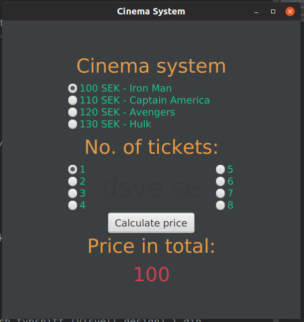

<h1>INLÄMNINGSUPPGIFT3, JAVAFX</h1>

<article>
    <h2>Mål</h2>
    
I Inlämningsuppgift 3 gör du ett programmed ett grafiskt gränssnitt i JavaFX.

</article>

<article>
    <h2>Beskrivning</h2>
    
Du ska göra ett program som utgörs av ett grafiskt gränssnitt. Programmet ska göras i JavaFX. Du väljer själv vilken typ av funktionalitet ditt programska ha.

    <h3>Exempel</h3>
    
Bokning av biljetter till t.ex:

    <ul>
        <li>Bio</li>
        <li>Idrott</li>
        <li>Konserter</li>
        <li>Resor</li>
    </ul>
    
Inlämningsuppgiften ska göras individuellt.

</article>

<article>
<h2>Betygskriterier</h2>
<h3>Krav för G</h3>
<ul>
    <li>Programmet görs i JavaFx.</li>
    <li>Du strukturerar upp din kod med metoder (och ev. klasser) där det underlättar för strukturen av programmet.</li>
    <li>Du ska använda Javadoc i din kod för dokumentation.</li>
</ul>

<h3>Krav för VG</h3>

Utöver grunduppgiften:

<ul>
    <li>Du ska använda CSS för layout.</li>
    <li>Du ska utgå från principer för färger och typsnitt (Visuell design) i din layout.</li>
</ul>
</article>

<article>
<h2>Inlämning, planering och redovisning</h2>

<strong>Inlämningsuppgiften ska lämnas in senasttisdagden 18/12 kl.23.59.</strong>

Följande ska vara med:

<ul>
    <li>Källkoden till applikationen.</li>
</ul>

Lämna in som zip och döp till Inlämningsuppgift3, Förnamn Efternamn. Lämna in genom Itslearning. Finns koden på Github, skrivin länken på Itselarning.

<ul>
    <li><strong>Planering (upplägg) för programmetska visas upp för läraren senast v.49.</strong></li>
    <li><strong>Redovning sker för läraren onsdag 19/12kl.9.00 (ca 5minuter var).</strong></li>
</ul>
</article>

<article>
    <h2>Resultat</h2>
    
</article>

